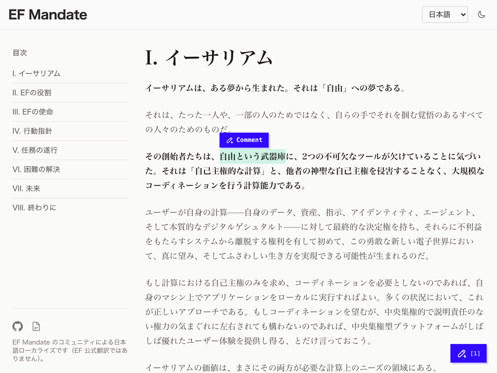
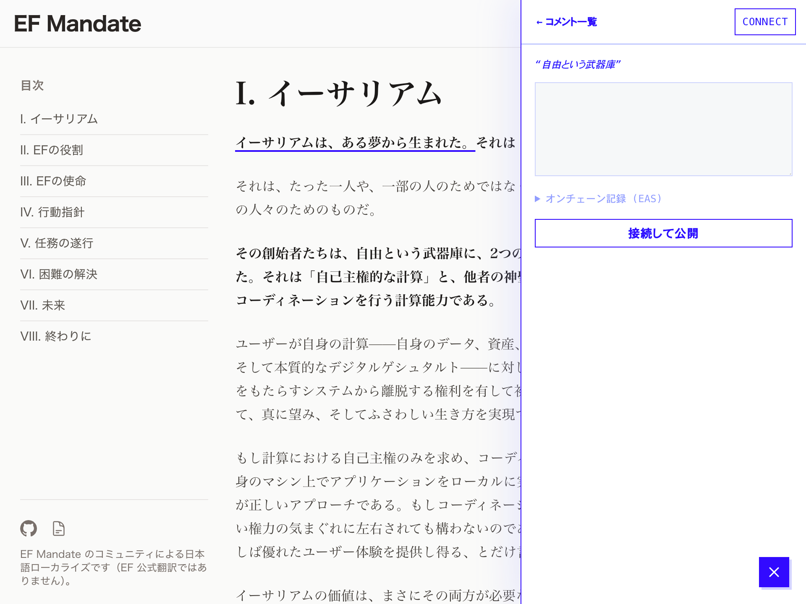
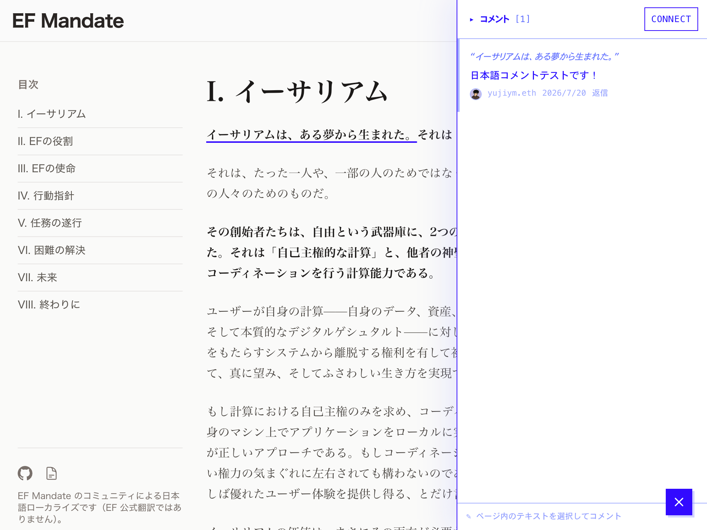
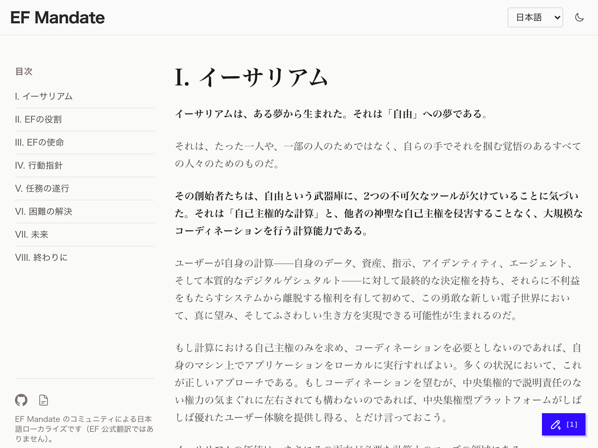

# @anno/widget

A standalone, embeddable **on-chain annotation widget**. Add one `<script>` tag to any
site and readers can attach comments to the exact text span they select — each comment is
an [EAS](https://attest.org) attestation, anchored so it survives edits to the page. No
backend, no build step on the host site.

## How it looks

| | |
|---|---|
|  |  |
| **1. Select text** — a "Comment" popover appears over the selection. | **2. Write & publish** — the comment is signed and stored on-chain (EAS). |
|  |  |
| **3. Read** — the panel lists comments; anchored spans are underlined in the page. | **4. Launcher** — a floating pill shows the page's comment count. |

## Embed

Build produces a single ESM loader (`dist/embed.js`) that lazy-loads the React app on
first use. Drop it on any page — e.g. from jsDelivr, which serves the latest build
published by CI to this repo's `widget-release` branch:

```html
<script
  type="module"
  src="https://cdn.jsdelivr.net/gh/ethereumjp/ef-mandate-localize-web@widget-release/packages/widget/dist/embed.js"
></script>
```

Any static host works the same way (same-origin, CDN, or IPFS/ENS) as long as `dist/`'s
files stay co-located — `embed.js` lazy-imports its hashed chunks by relative URL.

The loader injects a floating launcher pill plus a selection "Comment" popover, both inside
a shadow root (no style bleed into the host page).

### Configuration (`data-*` attributes)

| Attribute          | Required | Default                          | Notes |
|--------------------|----------|----------------------------------|-------|
| `data-schema-uid`  | No       | built-in canonical anno schema UID | Override to read/write a different EAS schema. |
| `data-network`     | No       | `mainnet`                        | Target network (`mainnet` or `sepolia`). `?mode=testnet` in the page URL forces `sepolia` — it wins even over an explicit `data-network`. |
| `data-rpc`         | No       | public node                      | Sepolia JSON-RPC endpoint (write path). |
| `data-mainnet-rpc` | No       | public node                      | Mainnet JSON-RPC endpoint (write path / ENS). |
| `data-eas-graphql` | No       | network default                  | EAS GraphQL read endpoint (defaults to the network's endpoint). |
| `data-position`    | No       | `bottom-right`                   | Launcher corner: `bottom-right` or `bottom-left`. |
| `data-lang`        | No       | `<html lang>` then `en`          | UI language. |
| `data-mock`        | No       | off                              | `1`/`true` uses bundled mock comments (demo, no chain calls). |

## Embedding notes

Things to know before dropping the widget on a third-party site:

### Version pinning & CDN caching

`@widget-release` is a moving branch: jsDelivr caches branch references (up to ~12h),
so new builds roll out with a delay and different visitors can briefly see different
versions. To freeze the widget, pin a commit instead:

```
https://cdn.jsdelivr.net/gh/ethereumjp/ef-mandate-localize-web@<commit-sha>/packages/widget/dist/embed.js
```

Subresource Integrity (`integrity=…`) only works with a pinned commit — the branch
URL's content changes on every release.

### Content-Security-Policy

On a page with a CSP, allow:

- `script-src`: the host serving `embed.js` (e.g. `cdn.jsdelivr.net`) — the loader
  also dynamically `import()`s its hashed app chunk from the same directory.
- `connect-src`: the EAS GraphQL endpoint for the target network (see
  `@anno/core/chain`) and the JSON-RPC endpoints (the built-in public nodes, or
  whatever `data-rpc` / `data-mainnet-rpc` point at).

Wallet extensions (MetaMask/Rabby) inject their own transport and need no CSP entry.

### Page identity: how comments are grouped

Comments are fetched per page, keyed by a **canonicalized URL** (see
`@anno/core/anno/canonicalUrl`). Practical consequences:

- Query params are **kept** (only known tracking params like `utm_*` are dropped) —
  `?page=2` is a different comment bucket than the bare path.
- The `#fragment` is **dropped** — hash-routed SPA "pages" all share one bucket.
- The origin is part of the key: `www.` vs bare domain, http vs https, staging vs
  production, and IPFS-gateway mirrors each get **separate** comments.

Serve each piece of content from one canonical URL if you want one comment thread.

### Static/MPA sites only (no SPA route tracking)

The loader mounts once on page load and reads `location` at that moment. Client-side
navigations (`pushState`) don't re-fetch comments for the new URL — on an SPA the
widget keeps showing the first page's comments. Use it on static or server-rendered
multi-page sites.

### Anchor stability: mark your blocks

Selections anchor to the nearest stable block container: an element with
`data-block-id`, else one with an `id`, else the nearest block-level tag
(`p`, `li`, headings, …) located by an `:nth-of-type` path. On sites whose markup is
mostly anonymous `<div>`s, or whose DOM structure shifts between deploys, comments
degrade to quote-based re-anchoring ("needs review" / orphaned) more often. For the
most durable anchors, give your content blocks stable `id` or `data-block-id`
attributes.

### Widget UI placement

The launcher pill is `position: fixed` at a corner with a near-maximal `z-index`. If
it collides with your own floating UI (chat widgets etc.), switch corners with
`data-position="bottom-left"`. All widget styles live in a shadow root, so there is
no CSS bleed in either direction.

## Develop

```bash
pnpm --filter @anno/widget build       # Vite → dist/embed.js + lazy app chunk
pnpm --filter @anno/widget test        # Vitest unit tests
pnpm --filter @anno/widget typecheck   # tsc --noEmit
pnpm --filter @anno/widget serve:test  # static server on :5180 (requires python3)
# then open http://localhost:5180/test/  (dogfoods the built embed.js on a plain page)
```

## Dependencies & assumptions

- The mounted app is a React 19 island using wagmi/viem for wallet + chain access and for
  attestations (a viem `writeContract` against the EAS contract — no ethers, no EAS SDK).
- Anchoring, selectors, schema encode/decode, and EAS read helpers come from
  [`@anno/core`](../core).
- The host page needs readable text containers; the widget anchors selections to the
  nearest stable container (see `@anno/core/anno/selector`).

## Standalone build

`@anno/widget` builds and ships independently of `apps/web`. The web app bundles the built
`dist/` into its own site as same-origin `annotation/embed.js` (see the web app's
`embed:build` script). For everyone else, CI publishes each build to the `widget-release`
branch, served via jsDelivr (see `.github/workflows/deploy-widget.yml`) — but any static
host can serve `embed.js` the same way as long as `dist/`'s files stay co-located.
